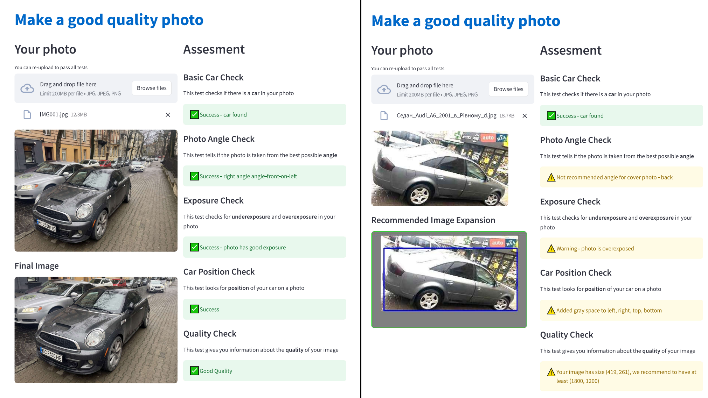
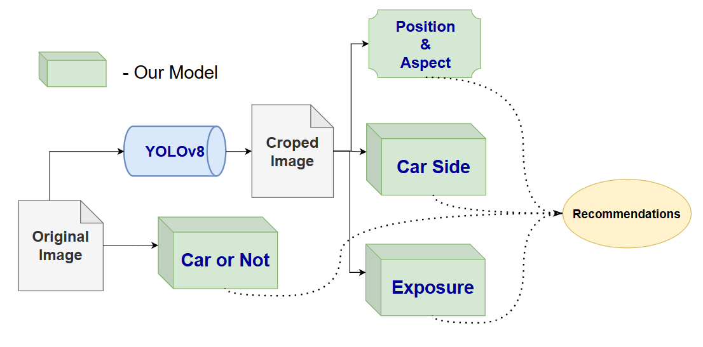

# 🚗 Car Photo Quality Enforcer
A tool designed to automatically assess and improve car listing photos to ensure they meet quality standards for marketplaces and classified listings.

## Overview
This app helps users verify whether their car photo meets a range of criteria that are typically expected for professional or marketplace listings. It evaluates:

- Presence of a car

- Photo angle

- Exposure (overexposed / underexposed)

- Car positioning

- Image resolution

The project was developed by Ustym Hentosh and Lev Kupybida.

## Run
`pip install requirements.txt`  
`cd app`  
`streamlit run main.py`  

## Data
Training data was scraped from online car marketplaces, such as auto.ria.com, across various categories and manufacturing years:

**Body Types:** Sedan, SUV/Crossover, MiniVan, Hatchback, Pickup 
**Side Types:** profile-on-right, profile-on-left, front, back, angle-front-on-right,  angle-front-on-left,  angle-back-on-right, angle-back-on-left

Year Ranges: 2000–2005, 2005–2010, ..., up to 2020–2025

- ~500 photos per body type → ~2200 photos total
- ~200 from different sides → ~1600 photos total

Data scraping was done via BeautifulSoup.

## Architecture
The app is implemented using Streamlit for the frontend and runs multiple deep learning models in the backend to evaluate different aspects of the uploaded image.

### App Flow

-> Upload Photo

-> Run tests:

✅ Car or not (binary classifier)

✅ Photo angle (multi-class classifier)

✅ Exposure test (two binary classifiers: overexposed / underexposed)

✅ Car cropping (YOLO-based detection)

✅ Positioning check (crop quality and gray border if needed)

✅ Quality check (image resolution)

Model Components
| Task                 | Model                | Type            | Path                          |
| -------------------- | -------------------- | --------------- | ----------------------------- |
| Car detection        | `CarOrNot`           | CNN (2 classes) | `car_or_not_detection_v0.pth` |
| Angle classification | `CarSide`            | CNN (8 classes) | `side_detection_v0.pth`       |
| Overexposure check   | `OverexposedOrNot`   | Binary CNN      | `overexposed_model.pth`       |
| Underexposure check  | `OveredarkenedOrNot` | Binary CNN      | `overdarkened_model.pth`      |
| Car positioning      | `CarChopper`         | YOLOv8          | `yolov8n.pt`                  |
| Smart crop tool      | `Croper`             | Heuristic/YOLO  | Custom code                   |

All models are loaded once and cached using @st.cache_resource.